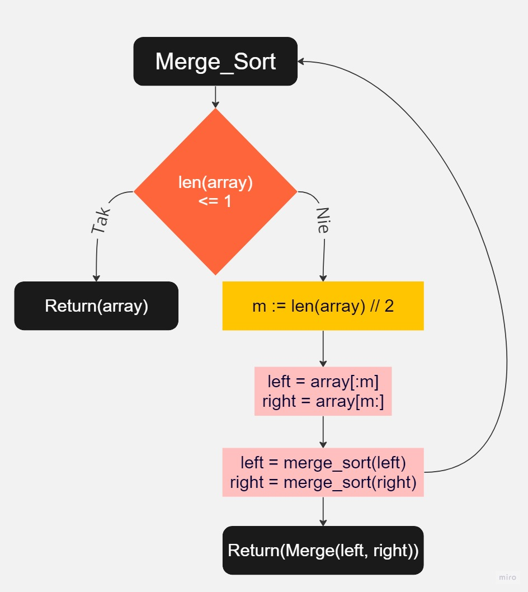
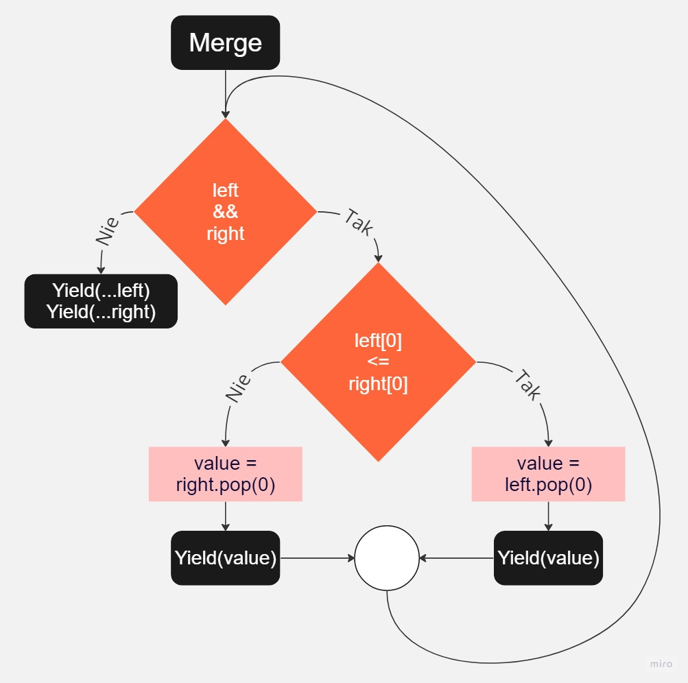

```python3
from typing import Any


def merge_sort(collection: [Any]) -> [Any]:
    def merge(left, right) -> [Any]:
        merged = []
        while left and right:
            if left[0] <= right[0]:
                merged.append(left.pop(0))
            else:
                merged.append(right.pop(0))
        merged.extend(left)
        merged.extend(right)
        return merged

    if len(collection) <= 1:
        return collection

    middle = len(collection) // 2
    
    left = collection[:middle]
    right = collection[middle:]
    
    left_half = merge_sort(left)
    right_half = merge_sort(right)

    return merge(left_half, right_half)
```

```python3
from typing import Any


def merge_sort(collection: [Any]) -> [Any]:
    def merge(left, right) -> [Any]:
        merged = []
        while left and right:
            merged.append(
                (right, left)[left[0] <= right[0]].pop(0)
            )
        merged.extend(left or right)
        return merged

    if len(collection) <= 1:
        return collection

    middle = len(collection) // 2
    
    left = collection[:middle]
    right = collection[middle:]
    
    left_half = merge_sort(left)
    right_half = merge_sort(right)

    return merge(left_half, right_half)
```
```python3
from typing import Any, Generator


def merge_sort(collection: [Any]) -> [Any]:
    def merge(left, right) -> Generator[Any]:
        while left and right:
            yield (right, left)[left[0] <= right[0]].pop(0)
        yield from left
        yield from right

    if len(collection) <= 1:
        return collection

    middle = len(collection) // 2
    left_half = merge_sort(collection[:middle])
    right_half = merge_sort(collection[middle:])

    return list(merge(left_half, right_half))
```



